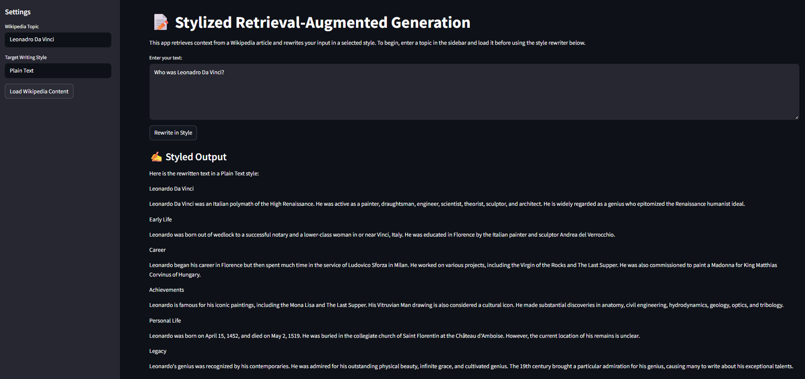
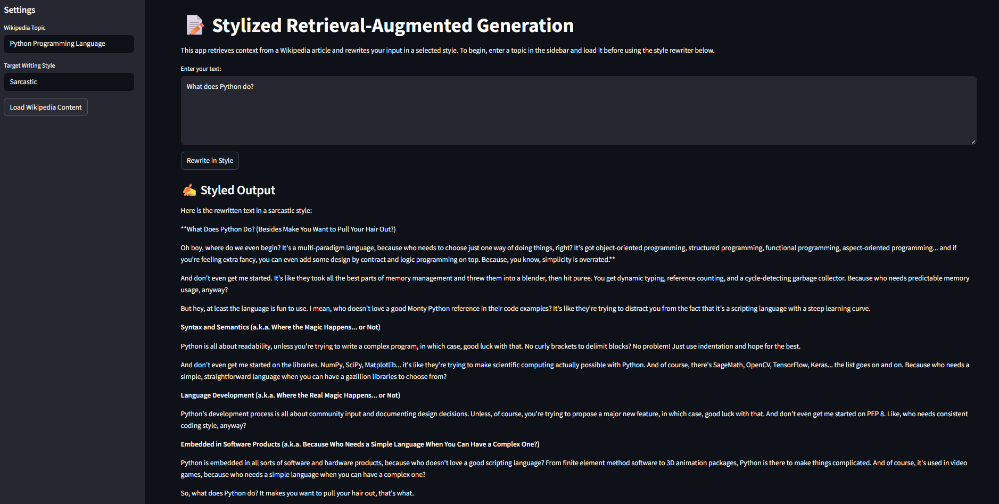
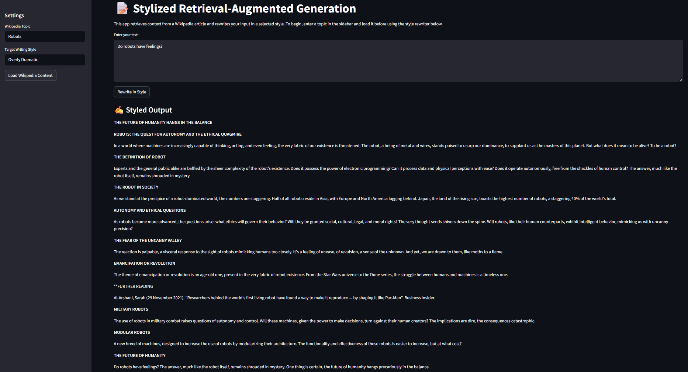

# 🎨 Stylized RAG: AI-Powered Text Style Transformer

Transform your text into different writing styles using AI! This Streamlit application combines Wikipedia knowledge with advanced language models to rewrite your text in various styles - from Shakespearean English to sarcastic commentary.


*Example of plain text transformation*

## ✨ Features

- **Wikipedia Integration**: Automatically fetches relevant context from Wikipedia articles
- **Multiple Writing Styles**: Transform text into various styles including:
  - Poetic
  - Sarcastic
  - Old English
  - Dramatic
  - And more!
- **Smart Context Retrieval**: Uses both BM25 and vector search for better context understanding
- **User-Friendly Interface**: Simple and intuitive Streamlit UI
- **Distributed Processing**: Leverages Ray for distributed LLM orchestration
- **Scalable Deployment**: Kubernetes-ready with KubeRay integration


*Example of sarcastic style transformation*

## 🏗️ Tech Stack

### Core Components
- **Frontend**: Streamlit
- **LLM Integration**: LangChain with Groq (LLaMA 3)
- **Vector Search**: Sentence Transformers
- **Text Search**: BM25
- **Containerization**: Docker
- **Orchestration**: Kubernetes with KubeRay
- **CI/CD**: GitHub Actions

### Infrastructure
- **Local Development**: Minikube
- **Container Registry**: Docker Hub
- **Distributed Computing**: Ray Cluster
- **Environment Management**: Python venv

## 🚀 Quick Start

### Local Development

1. **Clone the repository**
```bash
git clone https://github.com/Sahana24/stylized-rag.git
cd stylized-rag
```

2. **Set up your environment**
```bash
python -m venv venv
source venv/bin/activate  # On Windows: venv\Scripts\activate
pip install -r requirements.txt
```

3. **Configure your API keys**
Create a `.env` file in the root directory with:
```
OPENAI_API_KEY=your_groq_api_key_here
OPENAI_API_BASE=https://api.groq.com/openai/v1
```

4. **Run the application**
```bash
streamlit run streamlit_app.py
```

### Kubernetes Deployment

1. **Start Minikube**
```bash
minikube start
```

2. **Deploy KubeRay Operator**
```bash
choco install kubernetes-helm
helm repo add kuberay https://ray-project.github.io/kuberay-helm/
helm install kuberay-operator kuberay/kuberay-operator
```

3. **Deploy Ray Cluster**
```bash
kubectl apply -f ray-cluster.yaml
```

4. **Deploy Application**
```bash
kubectl apply -f streamlit-app.yaml
```

## 🐳 Docker & CI/CD

### Building Locally
```bash
docker build -t stylized-rag .
docker run -p 8501:8501 stylized-rag
```

### CI/CD Pipeline
The project uses GitHub Actions for automated builds and deployments:
- Automatic Docker image builds on push to main
- Image tagging and pushing to Docker Hub
- Kubernetes deployment updates

## 🎮 How to Use

1. Enter a Wikipedia topic in the sidebar (e.g., "Artificial Intelligence")
2. Click "Load Wikipedia Content" to fetch relevant context
3. Enter your text in the main input box
4. Choose your desired writing style
5. Click "Rewrite in Style" to transform your text


*Example of dramatic style transformation*


---

*Made with ❤️ by [Sahana Yadnakudige Subramanya](https://github.com/Sahana24)* 
